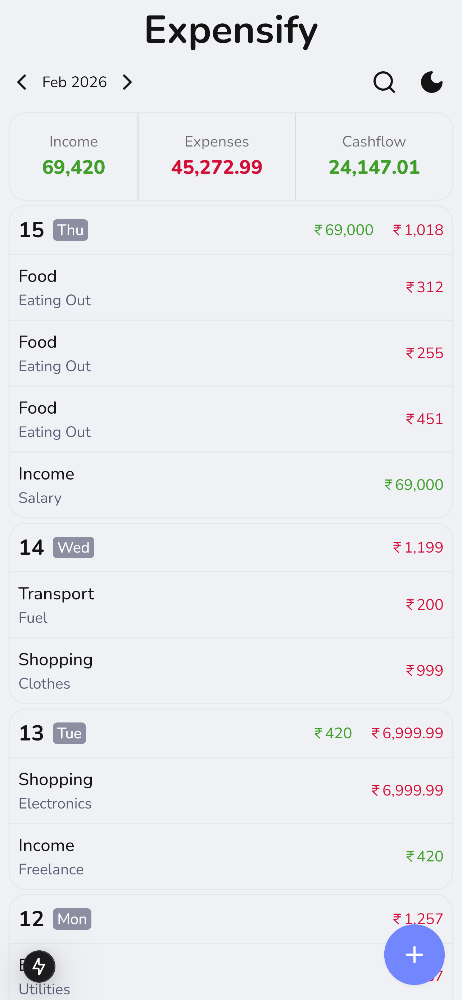
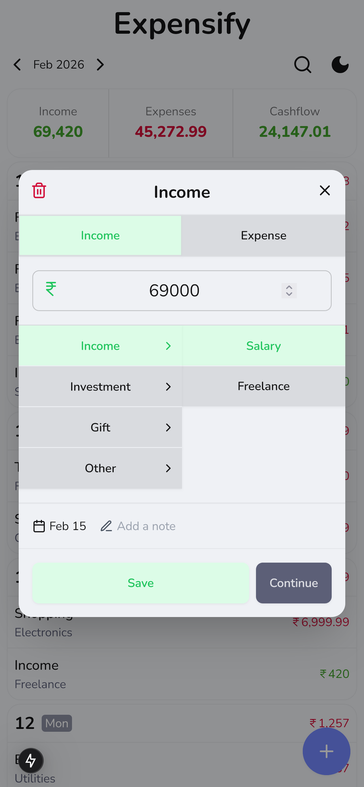

# 💰 Expensify - Modern Expense Tracker

A minimalist and intuitive expense tracking app built with modern web technologies. Track your spending habits with ease on any device.

<p float="left">
  
  
</p>

## ✨ Features

- 📱 Mobile-first responsive design
- 📊 Beautiful and Minimalist UI
- 🏷️ Categories and subcategories
- 🌙 Dark/Light mode

## 🛠️ Tech Stack

- ⚡ [Next.js 15](https://nextjs.org/) - React framework
- 🎨 [Tailwind CSS](https://tailwindcss.com/) - Styling
- 🌸 [DaisyUI](https://daisyui.com/) - UI components
- 🌊 [Drizzle ORM](https://orm.drizzle.team/) - Database ORM
- 🗄️ [Turso DB](https://turso.tech/) - Serverless Database
- ☁️ [Cloudflare Pages](https://pages.cloudflare.com/) - Hosting

## 🚀 Quick Start

1. Clone the repo
```bash
git clone https://github.com/adv1k/expensify
```

2. Install dependencies
```bash
pnpm install
```

3. Set up environment variables
```bash
cp example.env .env
```

4. Run development server
```bash
pnpm dev
```

## 🙏 Credits
Built with ❤️ by [Advik](https://github.com/ADV1K)
